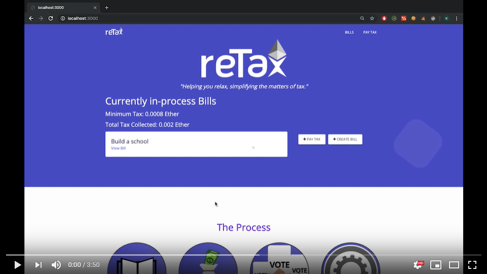

  

<h2 align="center"><em>Decentralized Tax System</em></h2>

  
  
  
  

## 👥 Team AntiSocialSocialClub

  <a href="https://github.com/gyr0tron/" rel="_blank">Simmar Kalsi</a>
   
  <a href="https://github.com/frozen4code/" rel="_blank">Bhupender Singh</a>
   
  <a href="https://github.com/bhaktijkoli/" rel="_blank">Bhaktij Koli</a>

---

<strong>🌐 Hosted at: </strong><a href="https://www.retax.ml" target="_blank">https://www.retax.ml</a> 🌎

Using decentralized technology, get to know and also decide on what public bill your tax payment goes to.

😽  Helping you relax, simplifying the matters of tax 💰

---

<h2> 🎥 Demo Video</h2>
  
 

## 📦 Technologies Used

- [React](https://reactjs.org/)
- [Next.js](https://nextjs.org/)
- [Solidity](https://solidity.readthedocs.io/en/v0.5.11/)
- [Ethereum](https://www.ethereum.org/)
- [Web3](https://github.com/ethereum/web3.js/)
- [IPFS](https://ipfs.io/)
- [Semantic-UI](https://react.semantic-ui.com/)

## 🌟 Features

- Decentralized
- Tamper proof
- Eliminates corruption
- Uploading bill related documents
- User-friendly Interface

## 🛠 Installation & Usage

1. Install browser extension [Metamask](https://metamask.io/). [How it works](https://youtu.be/ZIGUC9JAAw8)
2. Sign up and generate security phrase on Metamask.
3. Create more virtual accounts on Metamask.
4. Collect Test Etherium [Rinkeby Faucet](http://rinkeby-faucet.com/). Copy your wallet hash from browser extension and paste it in the input. Generate atleast 0.01 ETH in a wallet.
5. Install [nodejs](https://nodejs.org/).
6. Clone the repository `git clone https://github.com/gyr0tron/reTax.git`
   > Note: If using Windows, install windows-build-tools by running `npm install -g windows-build-tools`
7. Locate the repository `cd /path/to/dir/reTax/ && npm install`
8. Start the development server `npm run dev`
9. Visit [localhost:3000](http://localhost:3000/)

## 🛣️ Tracks Used

- Influence The Mass
- Nuture The Future
- Enhance The Social Norms

##  AWS Services Used

- AWS EC2 Instance for hosting web application
- AWS EC2 Instance for hosting local IPFS node

## 📝 Note

This project was developed in about 24 hours at [HaXplore](https://codefest.tech/haxplore) by `Team AntiSocialSocialClub`. We are open to suggestions and any help to related to the project.

## 👩‍💻 Contributing 👨‍💻

Please take a look at our [contributing](https://github.com/gyr0tron/reTax/blob/master/CONTRIBUTING.md/) guidelines if you are interested in helping!
